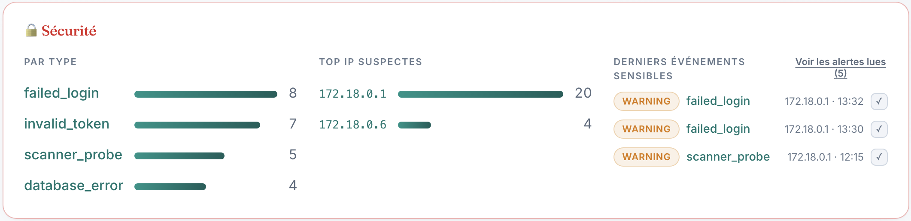
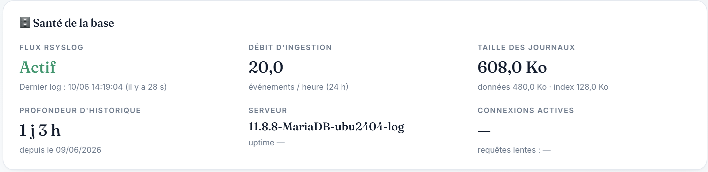
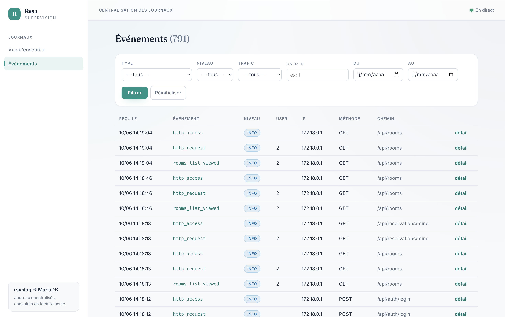
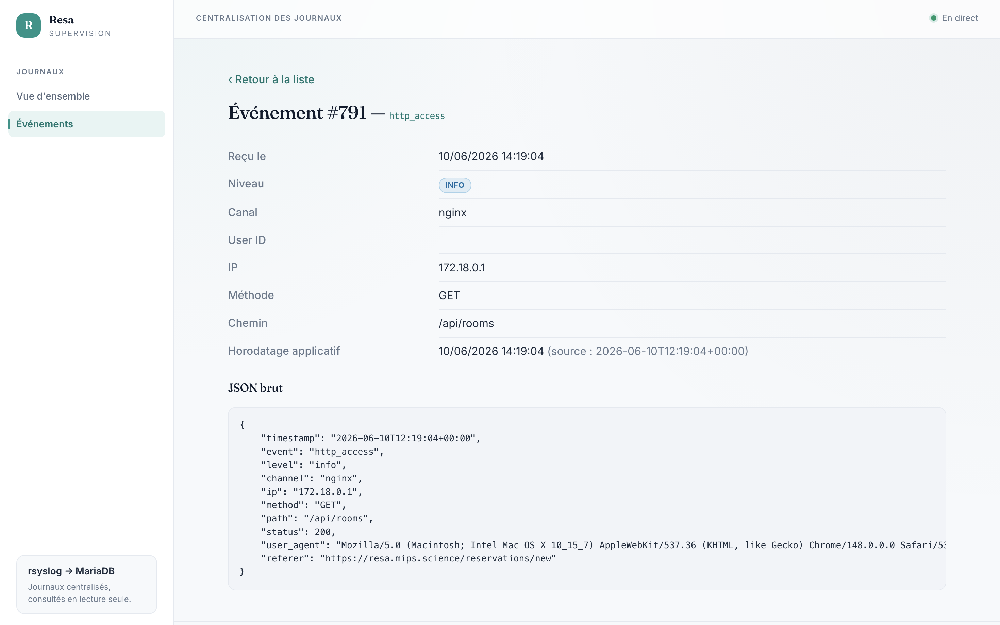

# Documentation utilisateur

Cette documentation est organisée **par cas d'utilisation**. Deux applications
cohabitent : **Resa** (qui génère les journaux) et le **Dashboard** (qui les consulte).

## Rôles utilisateurs

| Rôle | Application | Droits |
|------|-------------|--------|
| **Visiteur** | Resa | s'inscrire, se connecter |
| **Utilisateur (USER)** | Resa | consulter les salles, créer/modifier/annuler **ses** réservations |
| **Administrateur (ADMIN)** | Resa | gérer salles, équipements, utilisateurs, voir toutes les réservations et les statistiques |
| **Exploitant / Analyste** | Dashboard | consulter les journaux centralisés (lecture seule) |

## Accès

| Application | URL | Identifiants |
|-------------|-----|--------------|
| Resa | <http://localhost> | admin : `admin@resa.test` / `password` (créé par le seed). Les autres comptes s'inscrivent. |
| Dashboard logs | <http://localhost:8080> | aucun (consultation, lecture seule) |

---

## Cas d'utilisation — Application Resa

### UC-01 — S'inscrire
1. Ouvrir le site (HTTPS) → **Créer un compte**.
2. Renseigner nom, email, mot de passe.
3. Validation → compte `USER` créé, connexion automatique.
> Journalise : `user_registered`.


*Figure 1 — Page de connexion Resa servie en HTTPS (cadenas/certificat valide).*

### UC-02 — Se connecter / se déconnecter
1. Page de connexion → email + mot de passe.
2. En cas d'échec, message d'erreur. → Journalise `failed_login` (warning).
3. Connexion réussie → `user_login`. Déconnexion via le menu → `user_logout`.

### UC-03 — Consulter les salles
1. Menu **Salles** → liste des salles disponibles (capacité, équipements).
2. Cliquer une salle → fiche détail. → Journalise `rooms_list_viewed`, `room_viewed`.


*Figure 2 — Liste des salles (capacité, équipements).*

### UC-04 — Créer une réservation
1. Menu **Nouvelle réservation** → choisir salle, date, créneau.
2. Valider. Contrôles métier : double réservation refusée (`double_booking_attempt`),
   capacité dépassée (`room_capacity_exceeded`), période invalide
   (`invalid_reservation_period`).
3. Succès → `reservation_created`.


*Figure 3 — Formulaire de création de réservation (salle, date, créneau).*

### UC-05 — Gérer mes réservations
1. Menu **Mes réservations** → liste.
2. Modifier (`reservation_updated`) ou annuler (`reservation_cancelled`).

### UC-06 — Administrer (ADMIN)
1. Espace admin → **Salles**, **Équipements**, **Utilisateurs**, **Réservations**, **Tableau de bord**.
2. Créer/modifier/supprimer salles, équipements, utilisateurs ; consulter les statistiques.
> Tout accès admin par un non-admin journalise `unauthorized_access` / `forbidden_action`.

---

## Cas d'utilisation — Dashboard de journalisation

### UC-07 — Vue d'ensemble
1. Ouvrir <http://localhost:8080>.
2. La page d'accueil est organisée en sections : **KPIs** (total d'événements,
   requêtes web, **trafic humain**, **bots & scans**, événements de sécurité),
   **Trafic humain vs bot** (barre + timeline 24 h + top user-agents de bots),
   **Sécurité**, **Santé de la base**, puis les **répartitions** (catégorie,
   niveau, canal) et le **top des événements**.
3. Les compteurs se rafraîchissent automatiquement (toutes les 15 s).
4. Si la base n'est pas encore prête (premier démarrage), une page d'attente s'affiche.


*Figure 4 — Vue d'ensemble : bandeau de KPIs et sections analytiques.*


*Figure 5 — Panneau Trafic : répartition humain/bot, timeline 24 h, top user-agents de bots.*


*Figure 6 — Sécurité : par type, top IP suspectes, derniers événements (avec acquittement « lu »).*


*Figure 7 — Santé de la base : flux rsyslog, débit d'ingestion, volumétrie, version serveur.*

### UC-08 — Lister et filtrer les événements
1. Menu **Événements** (`/events`) → liste paginée, du plus récent au plus ancien.
2. Chaque ligne : horodatage, type d'événement (+ badge **🤖 bot** le cas échéant),
   niveau, utilisateur, IP, méthode, chemin.
3. Filtres : type, niveau, **trafic (humain / bot)**, user ID, plage de dates.


*Figure 8 — Liste filtrable ; le filtre « Trafic » et le badge 🤖 bot distinguent les accès automatisés.*

### UC-09 — Consulter le détail d'un événement
1. Depuis la liste, cliquer un événement → `/events/show`.
2. Affiche tous les champs promus (dont le **trafic humain/bot**) **et le JSON brut** d'origine.


*Figure 9 — Fiche détail d'un événement et son JSON brut.*

### UC-10 — Vérifier la chaîne de centralisation (exploitant)
```bash
# Messages reçus par rsyslog
docker compose exec rsyslog tail -f /var/log/resa/events.log
# Événements insérés en base
docker compose exec mariadb \
  mariadb -u rsyslog -prsyslog_pwd rsyslog_dashboard \
  -e "SELECT id, received_at, event, level, user_id FROM events ORDER BY id DESC LIMIT 10;"
```

---

## Résolution de problèmes (FAQ)

| Symptôme | Cause probable | Solution |
|----------|----------------|----------|
| Dashboard affiche « base non prête » | MariaDB démarre après le dashboard | Attendre quelques secondes / `docker compose ps` (état `healthy`). |
| Aucun événement dans le dashboard | Pas encore d'activité sur Resa, ou seed non lancé | Naviguer dans Resa ; lancer `docker compose exec resa-backend php artisan db:seed --force`. |
| Impossible de se connecter à Resa | Compte non créé | S'inscrire (UC-01) ou utiliser l'admin du seed. |
| Le dashboard ne peut rien modifier | **Comportement attendu** | Le dashboard est en lecture seule (compte `dashboard_ro`, intégrité ANSSI). |

---

## Annexe — Captures d'écran à réaliser

Déposer les fichiers dans `docs/img/` avec **exactement** ces noms (ils sont déjà
référencés ci-dessus). Format PNG conseillé, largeur ~1200–1600 px, thème clair.

| Fichier | Quoi capturer | Conseils |
|---------|---------------|----------|
| `01-resa-login.png` | Page de connexion Resa | **Inclure la barre d'adresse** avec le `https://` et le cadenas (preuve HTTPS). |
| `02-resa-rooms.png` | Liste des salles | Plusieurs salles visibles (capacité/équipements). |
| `03-resa-reservation.png` | Formulaire de nouvelle réservation | Champs salle/date/créneau remplis. |
| `04-dashboard-overview.png` | Haut de la vue d'ensemble | Cadrer le **bandeau de KPIs** (total, requêtes web, humain, bots & scans, sécurité). |
| `05-dashboard-traffic.png` | Panneau « Trafic web — humain vs bot » | Montrer la barre empilée + la timeline + le top user-agents. |
| `06-dashboard-security.png` | Panneau « Sécurité » | Idéalement avec un `scanner_probe` visible et le bouton ✓ « lu ». |
| `07-dashboard-db-health.png` | Panneau « Santé de la base » | Flux « Actif », débit, taille, version. |
| `08-dashboard-events.png` | Page Événements | **Déplier le filtre Trafic** et avoir au moins une ligne avec le badge 🤖 bot. |
| `09-dashboard-event-detail.png` | Détail d'un événement | Montrer la ligne « Trafic » + le JSON brut. |
| `10-https-cadenas.png` | Détail du certificat (clic sur le cadenas) | Preuve du certificat **Let's Encrypt valide** pour le domaine. |
| `11-scanner-403.png` | Preuve du blocage anti-scan | Onglet réseau du navigateur (ou terminal) montrant `GET /.env → 403`. |

> **Comment générer rapidement le trafic bot/scan** (pour des captures parlantes),
> depuis l'hôte :
> ```bash
> curl -k https://<RESA_DOMAIN>/.env https://<RESA_DOMAIN>/wp-admin     # → scanner_probe (403)
> curl -k -A "curl/8.0 bot" https://<RESA_DOMAIN>/                       # → trafic classé bot
> ```
> Recharge ensuite le dashboard : les compteurs « Bots & scans » et le panneau
> Sécurité se mettront à jour.
