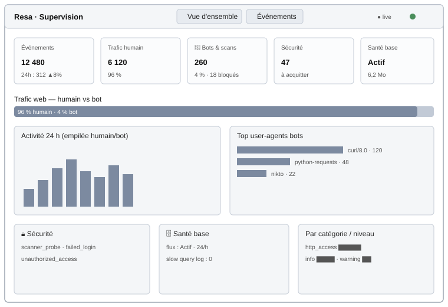

<!-- _class: lead -->

# Centralisation et supervision des journaux

### rsyslog → MariaDB → **Dashboard PHP (MVC)**

Conteneurisation Docker · sécurité par moindre privilège · HTTPS

**Mathéo Moreira** — Chef de Projet Informatique

---

## Contexte — analyse de l'existant

- Une application web existante, **Resa** (réservation de salles, Laravel + React),
  produit en continu des **événements métier et de sécurité**.
- Aujourd'hui, ces journaux sont **dispersés** : logs applicatifs, logs du serveur web,
  logs de base de données — hétérogènes et stockés localement.
- Conséquences : investigation lente en cas d'incident, et **aucune garantie d'intégrité**
  des traces.

> **Problème à résoudre :** centraliser, normaliser, sécuriser et **visualiser** les
> journaux de cette application.

<span class="small">À partir d'ici, le projet porte sur le **système de journalisation**, non sur l'application de réservation.</span>

---

## Expression du besoin

| # | Besoin |
|---|--------|
| **B1** | **Centraliser** tous les journaux en un point unique |
| **B2** | **Normaliser** le format (pour filtrer et agréger) |
| **B3** | **Garantir l'intégrité** (lecture seule côté consultation) |
| **B4** | **Visualiser** : vue d'ensemble + détail |
| **B5** | Mettre en évidence les **événements de sécurité** |
| **B6** | Déploiement **reproductible** (conteneurisation) |

*Besoins d'évolution identifiés :* rétention/purge, alerting sur seuils, TLS du transport interne.

---

## Objectifs du projet (SMART)

| Objectif | Mesurable |
|----------|-----------|
| **O1** Centraliser 100 % des événements de la source | 0 perte sur la chaîne |
| **O2** Garantir l'intégrité par moindre privilège | consultation = `SELECT` seul |
| **O3** Dashboard MVC de visualisation | vue d'ensemble + liste + détail |
| **O4** Déploiement en une commande | `docker compose up` → 6 services |
| **O5** Tracer les accès réseau | **IP source réelle** restituée |
| **O6** Sécuriser le périmètre | HTTPS + blocage scans + classif. bot |

---

## Fonctions principales

- **F1 — Émission** de journaux structurés (JSON sur une ligne)
- **F2 — Collecte / centralisation** : rsyslog (TCP/UDP 514, module `ommysql`)
- **F3 — Persistance normalisée** : table `events` (JSON brut + **colonnes générées indexées**)
- **F4 — Visualisation** : vue d'ensemble, liste paginée, fiche détail
- **F5 — Mise en évidence sécurité** : événements distingués par type/niveau
- **F6 — Cloisonnement des privilèges** : deux comptes SQL distincts (écriture / lecture)
- **F7 — Classification humain / bot** du trafic web
- **F8 — Durcissement du frontend** : HTTPS (Caddy), anti-scan, IP réelle

---

## Critères de performances

| Critère | Cible | **Mesuré** |
|---------|-------|------------|
| Réponse « vue d'ensemble » | < 500 ms | **~12 ms** (base de démo) |
| Latence d'ingestion (app → base) | < 1 s | insertion directe `ommysql` |
| Volumétrie supportée | ≥ 10⁶ lignes | banc **1 000 000 lignes** : pagination ~0,8 ms, agrégations ~200–300 ms |

**Optimisation mesurée :** KPI trafic humain/bot à 1 M de lignes
**~4 210 ms → ~80 ms (≈ 50×)** grâce à un **index composite `(channel, is_bot)`**
(*covering index*, validé par `EXPLAIN`), intégré au schéma.

---

## Contraintes techniques

- **Runtime** : Docker Engine + plugin `docker compose` (Linux)
- **6 conteneurs** : `caddy` · `frontend (nginx)` · `backend` · `rsyslog` · `mariadb` · `dashboard`
- **Réseau** :
  - port **514 (rsyslog) non publié** sur l'hôte (cloisonnement)
  - frontend interne non publié ; **entrée publique unique via Caddy : 80 → 443 (HTTPS)**
- **TLS** : certificat **Let's Encrypt** automatique (Caddy)
- **Sécurité** : moindre privilège DB (2 comptes : `INSERT` vs `SELECT`)
- **Format d'échange** : JSON sur une ligne (compatible `ommysql` + colonnes générées)

---

## Liste des livrables

| # | Livrable |
|---|----------|
| **L1** | Instrumentation de la source — service de journalisation (JSON structuré) |
| **L2** | Service **rsyslog** + schéma de base `events` |
| **L3** | **Dashboard PHP MVC** (consultation) |
| **L4** | Orchestration **Docker** (6 services, volumes persistants) |
| **L5** | Documentation (ANSSI, conception, utilisateur, tests) |
| **L6** | Diagrammes UML & schémas |
| **L7** | Qualité logicielle (**PHPStan niveau 6**, **PHPUnit 28 tests**) |

---

## Tâches par livrable · répartition

**Projet individuel — Mathéo Moreira (100 %)** : conception, développement, conteneurisation, documentation, tests.

| Livrable | Tâches clés |
|----------|-------------|
| L1 | Service `EventLogger` (JSON), formatters, événements de sécurité |
| L2 | Image rsyslog `ommysql` ; extraction regex ; schéma `events` (colonnes générées) |
| L3 | MVC maison (Router · Controller · View · Database PDO) ; vues |
| L4 | `docker-compose.yml` ; 2 comptes MariaDB ; forward nginx + slow query log |
| L5/L6 | Dossier documentaire + UML (use case, déploiement, synoptique, sitemap, mockup) |
| L7 | PHPStan niveau 6 (0 erreur) ; 28 tests PHPUnit ; banc de performance |

---

## Matériels et logiciels mis en œuvre

| Composant | Rôle | Version |
|-----------|------|---------|
| Docker Engine / Compose | Orchestration | plugin `compose` v2 |
| Caddy | Reverse-proxy public + TLS auto | `caddy:2-alpine` |
| nginx | Frontend + `http_access` + blocage scans | image officielle |
| rsyslog (`ommysql`) | Collecte + insertion en base | image dédiée |
| MariaDB | Base de centralisation `events` | 11 · InnoDB · utf8mb4 |
| PHP (dashboard) | Visualisation MVC (PDO) | ≥ 8.1 |
| Composer | Autoload PSR-4 | ≥ 2 |

<span class="small">Projet logiciel : aucun matériel spécifique hors serveur hôte Docker (Linux, ≥ 2 Go RAM).</span>

---

## UML — diagramme de cas d'utilisation

```
  ┌──────────────┐      ┌──────────────────────────────────────────────┐
  │  Exploitant  │      │          Dashboard de journalisation          │
  │  / Analyste  │─────▶│  • Voir la vue d'ensemble                      │
  └──────────────┘      │  • Lister / filtrer les événements            │
                        │  • Consulter le détail (JSON brut)            │
                        │  • Vérifier la chaîne de centralisation       │
                        └──────────────────────────────────────────────┘

  ┌──────────────┐      ┌──────────────────────────────────────────────┐
  │ Application  │─────▶│  Émettre un événement (JSON)   «include»       │
  │   source     │      │   métier · accès réseau · sécurité            │
  └──────────────┘      └──────────────────────────────────────────────┘
     «extend» :  échec d'authentification · accès non autorisé · scan bloqué (403)
```

<span class="small">Source PlantUML : `docs/uml/use-case.puml`.</span>

---

## UML — diagramme de déploiement (6 services)

```
                         Internet
                            │ HTTPS :443
                     ┌──────▼───────┐
                     │     caddy     │  TLS Let's Encrypt · network host
                     └──────┬───────┘  (préserve l'IP cliente réelle)
          HTTP interne (+ X-Forwarded-For)
                     ┌──────▼───────┐   proxy /api    ┌────────────────┐
                     │   frontend    │───────────────▶│    backend      │
                     │ nginx + SPA   │                │ (émet les logs) │
                     │ anti-scan 403 │  http_access   └───────┬────────┘
                     └──────┬───────┘                  events │ JSON
                  TCP 514   │                          TCP 514│
                            └───────────────┬─────────────────┘
                                     ┌──────▼───────┐
                                     │   rsyslog     │  ommysql · 514 NON publié
                                     └──────┬───────┘
                              INSERT (compte rsyslog)
                                     ┌──────▼───────┐  SELECT (dashboard_ro)  ┌───────────┐
                                     │   mariadb     │◀────────────────────────│ dashboard │
                                     │ table events  │                         │ PHP (MVC) │
                                     └──────────────┘                         └───────────┘
```

<span class="small">Source PlantUML : `docs/uml/deploiement.puml`.</span>

---

## Schéma synoptique — flux de centralisation

```
   [ frontend ]        [ backend ]
    nginx/SPA           journalisation
        │                    │
        │ http_access        │ événements métier + http_request
        │ (IP réelle,        │ (JSON, TCP 514)
        │  scanners)         │
        └─────────┬──────────┘
                  ▼
            [ rsyslog ]  ── INSERT (ommysql, compte rsyslog) ──▶  ╔═══════════════╗
                                                                  ║   MariaDB      ║
   raw_json + colonnes générées indexées                         ║   events       ║
   (event, level, channel, user_id, ip, received_at, is_bot)     ╚═══════╤═══════╝
                                                                          │ SELECT
                                                                  (compte dashboard_ro,
                                                                   lecture seule)
                                                                          ▼
                                                                  [ dashboard PHP MVC ]
                                                                  vue d'ensemble · liste · détail
```

<span class="small">Source PlantUML : `docs/uml/synoptique.puml`.</span>

---

## Sitemap — plan du dashboard

```
   /  (vue d'ensemble)
   │        └····· AJAX ·····▶  /api/stats   (JSON, rafraîchissement 15 s)
   │
   ▼
   /events  (liste paginée + filtres : type · niveau · trafic humain/bot · dates)
   │
   ▼
   /events/show?id=…   (détail : champs promus + JSON brut d'origine)
```

- Une **page d'attente** s'affiche tant que MariaDB n'est pas prête (démarrage à froid).
- Erreur `404` propre sur route ou identifiant inconnu.

<span class="small">Source PlantUML : `docs/uml/sitemap.puml`.</span>

---

## Mockup — vue d'ensemble du dashboard



<span class="small">Maquette vectorielle (SVG versionné) · rendu réel correspondant : `docs/img/04-dashboard-overview.png`.</span>

---

<!-- _class: lead -->

# Merci

**Centralisation & supervision des journaux** — rsyslog · MariaDB · Dashboard PHP MVC

Code propre vérifié (PHPStan niveau 6 · 28 tests PHPUnit) · sécurité par moindre privilège · HTTPS · 6 services Docker

*Mathéo Moreira — CPI*
