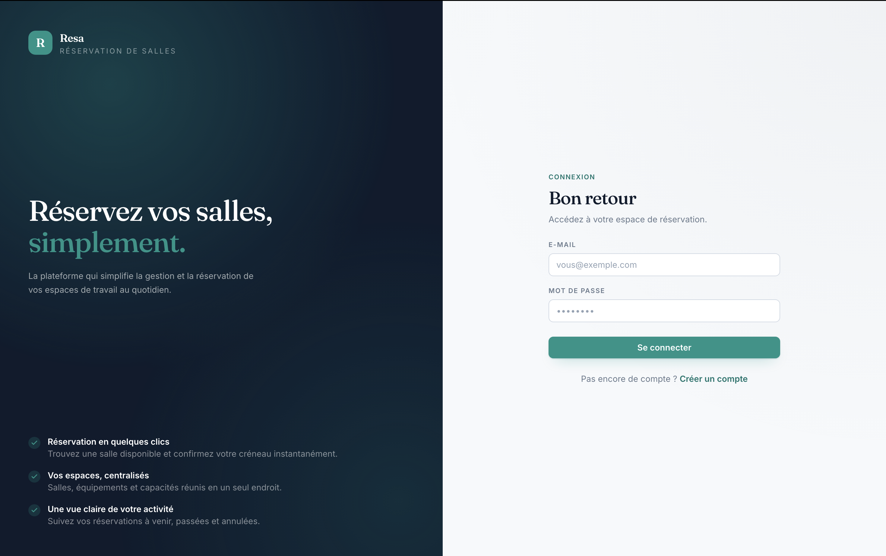
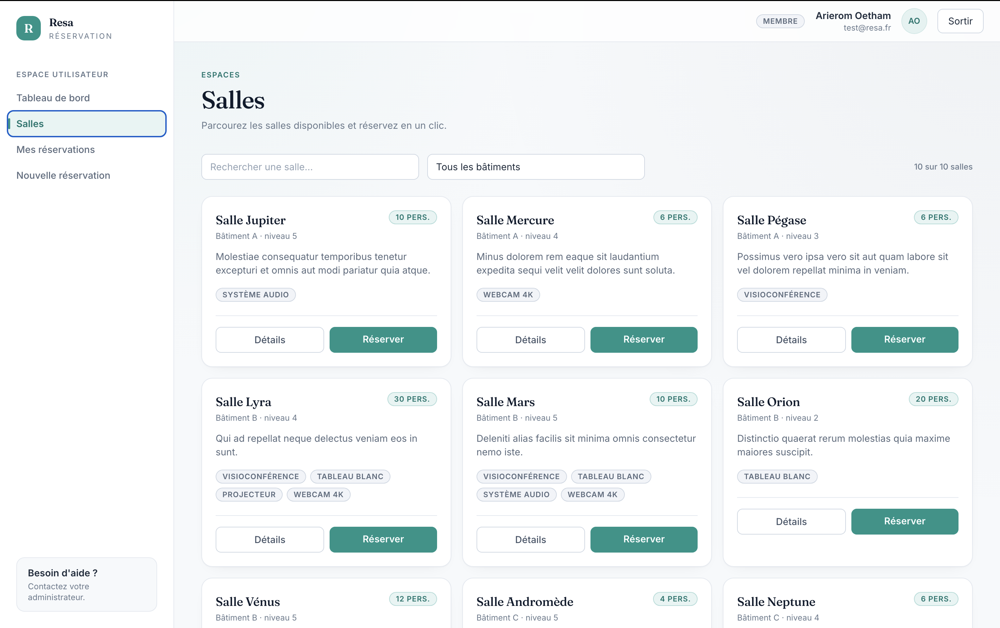
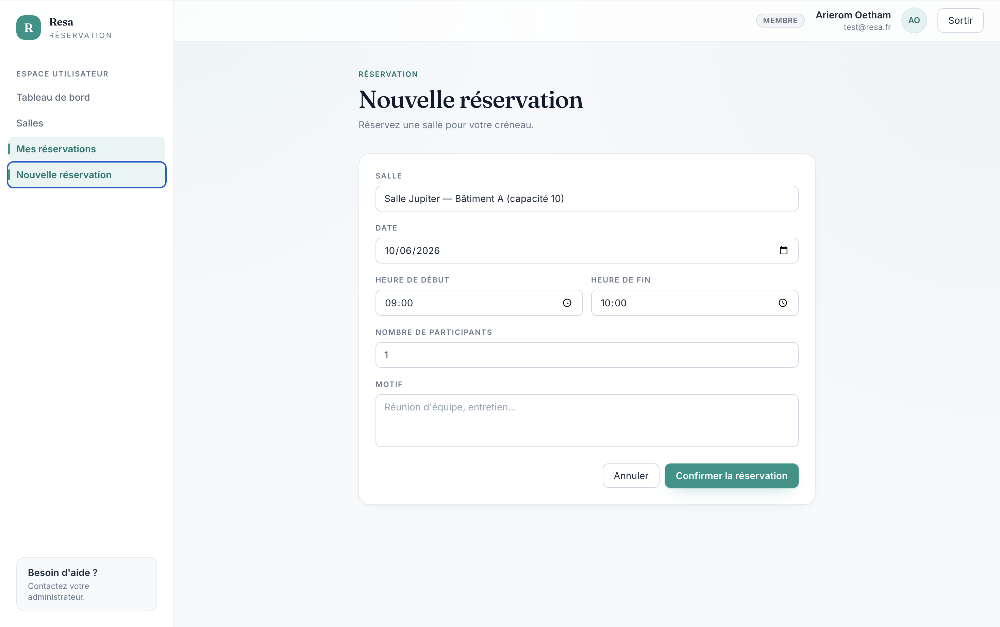
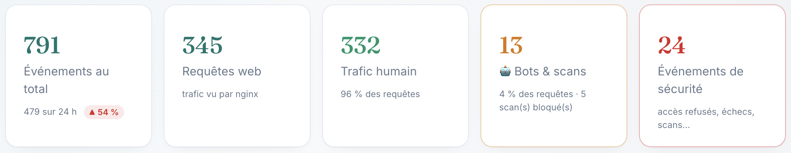
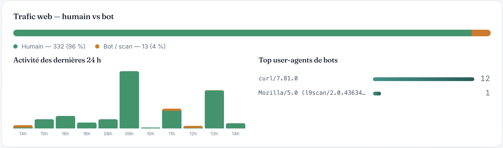
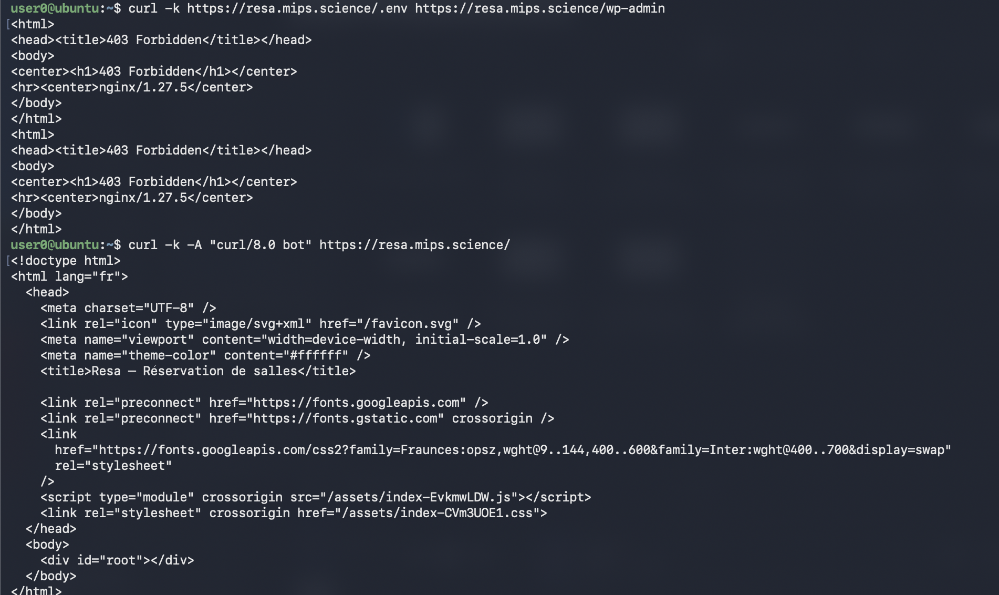

<!-- _class: lead -->

# Centralisation et supervision des journaux

### rsyslog → MariaDB → **Dashboard PHP (MVC)**

Conteneurisation Docker · sécurité par moindre privilège

**Mathéo Moreira** 

---

## Contexte — analyse de l'existant

- Une application web existante, **Resa** (réservation de salles, Laravel + React),
  produit en continu des **événements métier et de sécurité**.
- Aujourd'hui, ces journaux sont **dispersés** : logs applicatifs, logs du serveur web,
  logs de base de données — hétérogènes et stockés localement.
- Conséquences : investigation lente en cas d'incident, et **aucune garantie d'intégrité**
  des traces.

> **Problème à résoudre :** centraliser, normaliser, sécuriser et **visualiser** les
> journaux de cette application.

- **Délai** : projet mené du **8 au 11 juin 2026** (5 jalons J1 → J5).

<span class="small">À partir d'ici, le projet porte sur le **système de journalisation**, non sur l'application de réservation.</span>

---

## Contexte — l'application supervisée (Resa)

<div style="display:flex; gap:16px; justify-content:center; align-items:flex-start; margin-top:8px">
  
  
  
</div>

- **Resa** (Laravel + React) : connexion, catalogue de salles, réservation.
- C'est **la source des journaux** : chaque action (login, échec d'auth, accès API, réservation) produit un événement.

<span class="small">L'application n'est montrée qu'ici, pour le contexte. Le projet porte sur la supervision de ses journaux.</span>

---

## Expression du besoin

| # | Besoin |
|---|--------|
| **B1** | **Centraliser** tous les journaux en un point unique |
| **B2** | **Normaliser** le format (pour filtrer et agréger) |
| **B3** | **Garantir l'intégrité** (lecture seule côté consultation) |
| **B4** | **Visualiser** : vue d'ensemble + détail |
| **B5** | Mettre en évidence les **événements de sécurité** |
| **B6** | Déploiement **reproductible** (conteneurisation) |

*Besoins d'évolution identifiés :* rétention/purge, alerting sur seuils, TLS du transport interne.

---

## Objectifs du projet (SMART)

| Objectif | Mesurable |
|----------|-----------|
| **O1** Centraliser 100 % des événements de la source | 0 perte sur la chaîne |
| **O2** Garantir l'intégrité par moindre privilège | consultation = `SELECT` seul |
| **O3** Dashboard MVC de visualisation | vue d'ensemble + liste + détail |
| **O4** Déploiement en une commande | `docker compose up` → stack reproductible |
| **O5** Tracer les accès réseau | **IP source réelle** restituée |
| **O6** Distinguer les événements de sécurité | classification trafic humain/bot |

---

## Fonctions principales

- **F1 — Émission** de journaux structurés (JSON sur une ligne)
- **F2 — Collecte / centralisation** : rsyslog (TCP/UDP 514, module `ommysql`)
- **F3 — Persistance normalisée** : table `events` (JSON brut + **colonnes générées indexées**)
- **F4 — Visualisation** : vue d'ensemble, liste paginée, fiche détail
- **F5 — Mise en évidence sécurité** : événements distingués par type/niveau
- **F6 — Cloisonnement des privilèges** : deux comptes SQL distincts (écriture / lecture)
- **F7 — Classification humain / bot** du trafic web
- **F8 — Capture du trafic web** : IP source réelle et détection de scans (403) tracées via nginx (`http_access`)

---

## Fonctionnalités du Dashboard

- **Vue d'ensemble** : KPI temps réel — total, total 24 h, humain vs bot, sécurité.
- **Liste paginée + filtres** : type · niveau · trafic humain/bot · période.
- **Fiche détail** : champs promus + **JSON brut** d'origine.
- **Trafic web** : humain/bot, activité 24 h, top user-agents de bots.
- **Sécurité** : événements sensibles, alertes (`failed_login`, `scanner_probe`…).
- **Santé de la base** + **rafraîchissement AJAX** (15 s) · page d'attente au boot.



---

## Dashboard — événements : liste & détail

<div style="display:flex; gap:24px; justify-content:center; align-items:flex-start">
  
  
</div>

<span class="small">Liste filtrable (gauche) · fiche détail avec JSON brut (droite). **Adresses IP pseudonymisées (RGPD)** — non exposées dans le dashboard.</span>

---

## Dashboard — trafic & sécurité




<span class="small">Trafic humain/bot + top user-agents de bots (haut) · événements de sécurité et alertes (bas). **IP pseudonymisées (RGPD).**</span>

---

## Critères de performances

| Critère | Exigence | Mesuré | |
|---------|----------|--------|:-:|
| Réponse « vue d'ensemble » | < 500 ms | **~12 ms** | ✅ |
| Ingestion app → base | < 1 s | insertion directe (`ommysql`) | ✅ |
| Volumétrie | ≥ 10⁶ lignes | testé à **1 000 000** (430 Mio) | ✅ |

> ⚡ **Optimisation** — index composite `(channel, is_bot)` : le KPI trafic humain/bot passe de **4 210 ms → 80 ms (×50)** à 1 M de lignes (validé par `EXPLAIN`).

---

## Contraintes techniques

- **Langage** : **PHP ≥ 8.1**, programmation **orientée objet**
- **Architecture** : **MVC** maison (Router · Controller · Model · View · PDO), sans framework
- **Conteneurisation** : **Docker** + `docker compose` (déploiement reproductible)
- **Collecte** : **rsyslog** (module `ommysql`), transport **TCP/UDP 514**
- **Base de données** : **MariaDB** (table `events`, colonnes générées indexées)
- **Format d'échange** : **JSON** sur une ligne (compatible `ommysql`)
- **Sécurité** : moindre privilège DB (2 comptes `INSERT` / `SELECT`) · port **514 non publié**

<span class="small">L'exposition web publique de Resa (reverse-proxy Caddy + TLS) relève de l'existant et n'entre pas dans le périmètre du projet.</span>

---

## Liste des livrables

| # | Livrable |
|---|----------|
| **L1** | Instrumentation de la source — service de journalisation (JSON structuré) |
| **L2** | Service **rsyslog** + schéma de base `events` |
| **L3** | **Dashboard PHP MVC** (consultation) |
| **L4** | Orchestration **Docker** (6 services, volumes persistants) |
| **L5** | Documentation (ANSSI, conception, utilisateur, tests) |
| **L6** | Diagrammes UML & schémas |
| **L7** | Qualité logicielle (**PHPStan niveau 6**, **PHPUnit 28 tests**) |

---

## Tâches par livrable · répartition

**Projet individuel — Mathéo Moreira (100 %)** : conception, développement, conteneurisation, documentation, tests.

| Livrable | Tâches clés |
|----------|-------------|
| L1 | Service `EventLogger` (JSON), formatters, événements de sécurité |
| L2 | Image rsyslog `ommysql` ; extraction regex ; schéma `events` (colonnes générées) |
| L3 | MVC maison (Router · Controller · View · Database PDO) ; vues |
| L4 | `docker-compose.yml` ; 2 comptes MariaDB ; forward nginx + slow query log |
| L5/L6 | Dossier documentaire + UML (use case, déploiement, synoptique, sitemap, mockup) |
| L7 | PHPStan niveau 6 (0 erreur) ; 28 tests PHPUnit ; banc de performance |

---

## Matériels, logiciels & technologies

| Composant | Rôle | Version |
|-----------|------|---------|
| **OS — Ubuntu Linux** | Serveur hôte (≥ 2 Go RAM) | 22.04+ |
| **Docker** / Compose | Orchestration des conteneurs | Engine + plugin `compose` v2 |
| **PHP** (dashboard) | Visualisation MVC, POO (PDO) | ≥ 8.1 |
| **Composer** | Autoload PSR-4 | ≥ 2 |
| **rsyslog** (`ommysql`) | Collecte + insertion en base | image dédiée |
| **MariaDB** | Base de centralisation `events` | 11 · InnoDB · utf8mb4 |
| **nginx** (source) | Émission `http_access` (IP réelle, scans) | image officielle |

<span class="small">Projet logiciel : aucun matériel spécifique hors serveur hôte Docker. Outillage qualité : **PHPStan** (niveau 6) · **PHPUnit** · Git.</span>

---

## UML — diagramme de cas d'utilisation


<span class="small">Source PlantUML : `docs/uml/use-case.puml`.</span>

---

## UML — diagramme de déploiement (système de journalisation)


<span class="small">Resa est exposée publiquement via un reverse-proxy Caddy (TLS) en amont du frontend — hors périmètre. Source PlantUML : `docs/uml/deploiement.puml`.</span>

---

## Schéma synoptique — flux de centralisation


<span class="small">`raw_json` + colonnes générées indexées (event · level · channel · user_id · ip · received_at · is_bot). Source PlantUML : `docs/uml/synoptique.puml`.</span>

---

## Sitemap — plan du dashboard


- **Page d'attente** tant que MariaDB n'est pas prête (démarrage à froid) · erreur `404` propre sur route ou identifiant inconnu.

<span class="small">Source PlantUML : `docs/uml/sitemap.puml`.</span>

---

## Procédure d'installation

**Pré-requis** — Ubuntu Linux + Docker Engine & plugin `docker compose`.

```bash
# 1. Configurer
cp .env.example .env             # identifiants DB, ports

# 2. Construire et lancer la stack
docker compose up --build -d     # services up, mariadb healthy
docker compose ps

# 3. Initialiser les données (1re fois)
docker compose exec resa-backend php artisan db:seed --force
```

- **Dashboard de supervision** : <http://localhost:8080>
- Vérifier la chaîne : `docker compose exec rsyslog tail -f /var/log/resa/events.log`

---

## Tests de validation (recette)

Format **état initial → action → résultat attendu → obtenu** · 14 tests (T-01…T-14), dont **7 rejouables** via `db/verifs/run-recette.sh` (artefacts horodatés).

| Test | Vérifie | Obtenu |
|------|---------|:------:|
| T-02 | Échec d'auth → `failed_login` (warning) en base | ✅ |
| T-04 | Dashboard en **lecture seule** (`DELETE` refusé — `ERROR 1142`) | ✅ |
| T-05 | Collecteur cloisonné : port **514 injoignable** depuis l'hôte | ✅ |
| T-08 | Vue d'ensemble cohérente avec la base | ✅ |
| T-12 | Scan `/.env` → **403** + `scanner_probe` journalisé | ✅ |
| T-13 | Classification **humain / bot** (`is_bot`) | ✅ |

<span class="small">Qualité logicielle : **PHPStan niveau 6** (0 erreur) · **28 tests PHPUnit**.</span>

---

## Démonstration — des bots ont scanné l'app cette nuit

<div style="display:flex; gap:24px; justify-content:center; align-items:center">
  
  
</div>

- Des bots ont sondé `/.env`, `/wp-admin`, `/.git/config` → **bloqués en `403`** par nginx.
- Chaque sonde est journalisée (`scanner_probe`) et **classée bot** (`is_bot`).
- Le dashboard les fait ressortir : **top user-agents** `curl` · `l9scan`, trafic humain/bot.

<span class="small">Démo live : générer un scan (`curl -k https://…/.env`) et le voir apparaître dans le dashboard.</span>

---

<!-- _class: lead -->

# Merci

**Centralisation & supervision des journaux** — rsyslog · MariaDB · Dashboard PHP MVC

Code propre vérifié (PHPStan niveau 6 · 28 tests PHPUnit) · sécurité par moindre privilège · déploiement Docker

*Mathéo Moreira — CPI*
